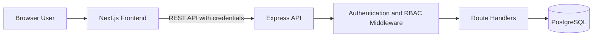
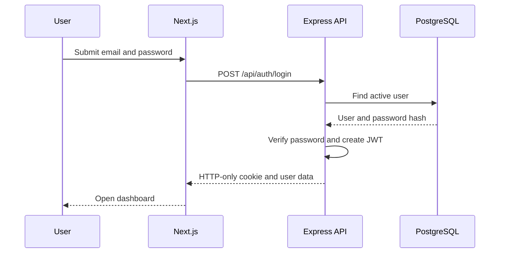
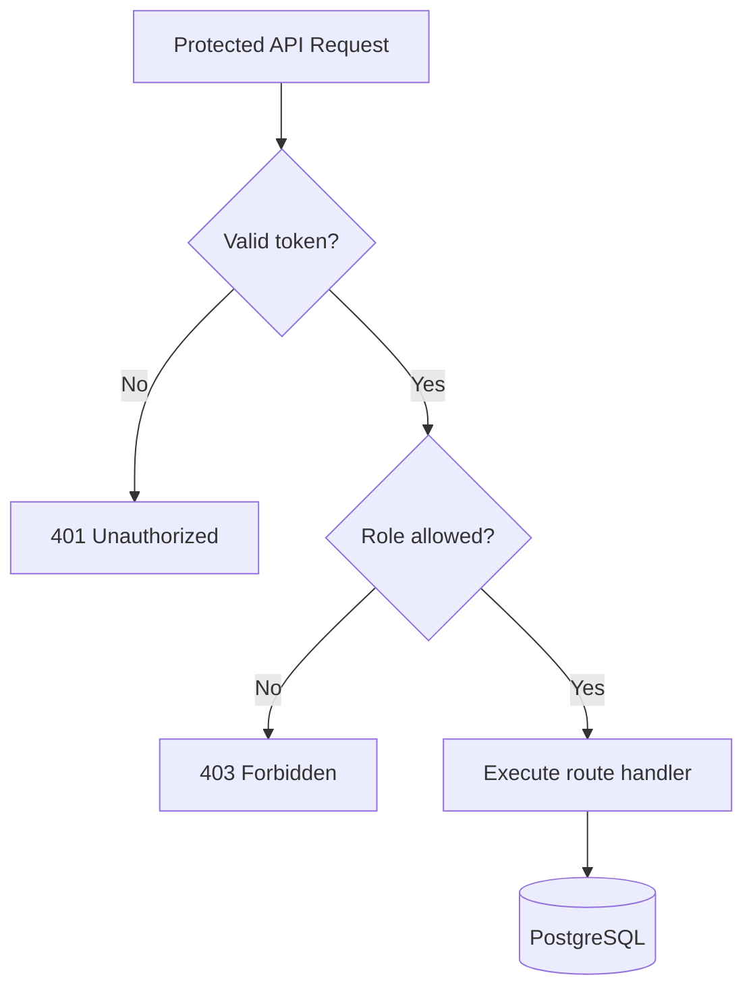
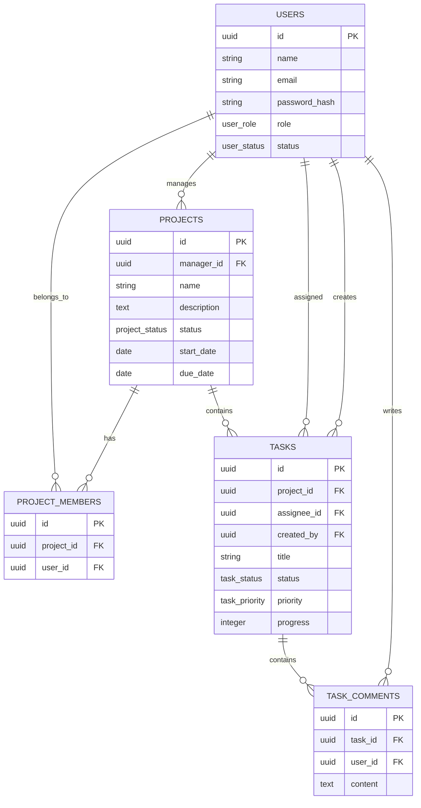
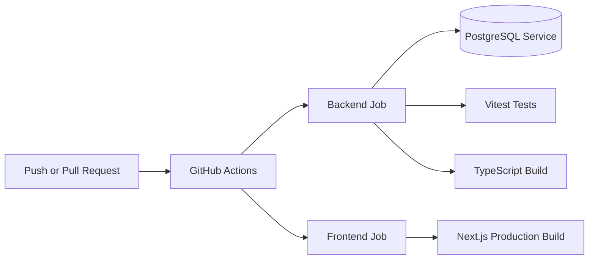

# TaskFlow Architecture and Design

## System overview

TaskFlow uses a three-tier architecture:

1. Next.js presentation layer
2. Express REST API and authorization layer
3. PostgreSQL persistence layer



## Frontend architecture

The frontend uses the Next.js App Router.

Main pages:

- `/login`
- `/dashboard`
- `/users`
- `/projects`
- `/tasks`

The authentication provider stores the authenticated user and communicates with:

- `POST /api/auth/login`
- `POST /api/auth/logout`
- `GET /api/auth/me`

Protected pages redirect unauthenticated users to `/login`.

## Backend architecture

The Express backend is divided into:

```text
src/
├── database/
├── lib/
├── middleware/
├── routes/
├── tests/
└── server.ts
```

### Route modules

- `auth.routes.ts`
- `user.routes.ts`
- `project.routes.ts`
- `task.routes.ts`

### Shared modules

- `db.ts` manages the PostgreSQL connection pool
- `auth.ts` creates and verifies authentication tokens
- `auth.middleware.ts` authenticates requests and checks roles

## Authentication flow



## Authorization rules



## Database entities

### Users

Stores user identity, hashed passwords, roles, and account status.

### Projects

Stores project information and references its manager.

### Project members

Implements the many-to-many relationship between projects and Team Members.

### Tasks

Stores project tasks, assignees, creators, priority, status, progress, and dates.

### Task comments

Stores comments connected to tasks and their authors.



## Validation

Zod schemas validate incoming API request bodies.

Validation includes:

- Email format
- Password requirements
- Allowed role and status values
- UUID parameters
- Progress between 0 and 100
- Date ordering
- Required project and assignee relationships

Database constraints provide a second validation layer.

## Continuous integration architecture



## Design decisions

### PostgreSQL

PostgreSQL supports relational integrity, UUID identifiers, enums, foreign keys, and transactional operations.

### REST API

REST endpoints provide a clear separation between the frontend and backend and can also be tested independently.

### Role-based access control

Authorization is enforced by the backend rather than relying only on hidden frontend controls.

### HTTP-only cookies

The authentication token is unavailable to normal browser JavaScript, reducing exposure to token theft through client-side scripts.

### Feature-branch workflow

Each major capability is developed and reviewed independently before being merged into `main`.