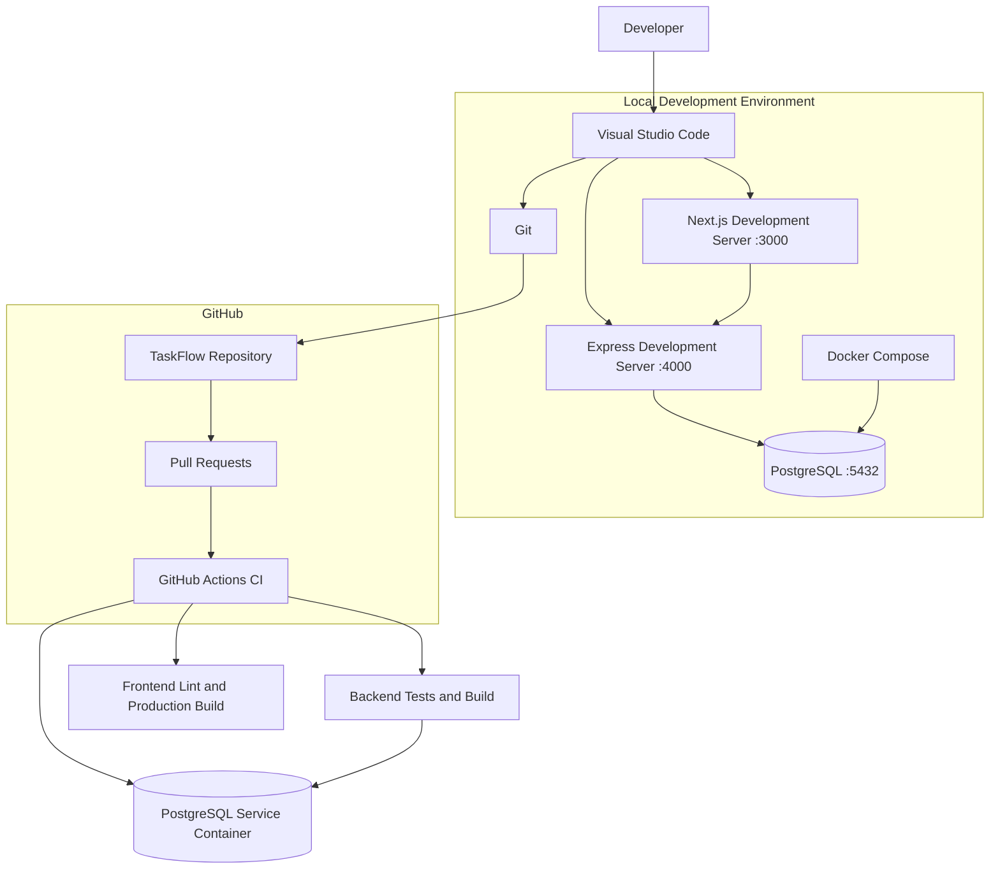
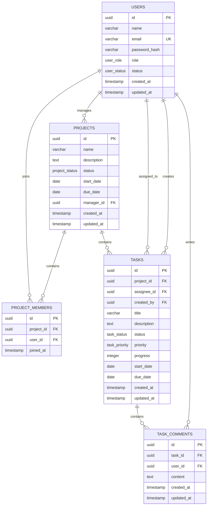
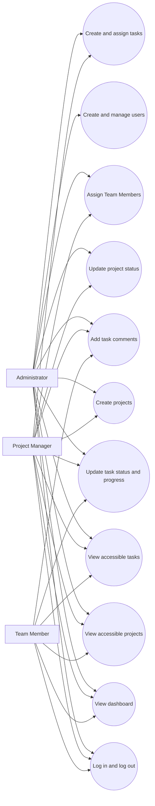
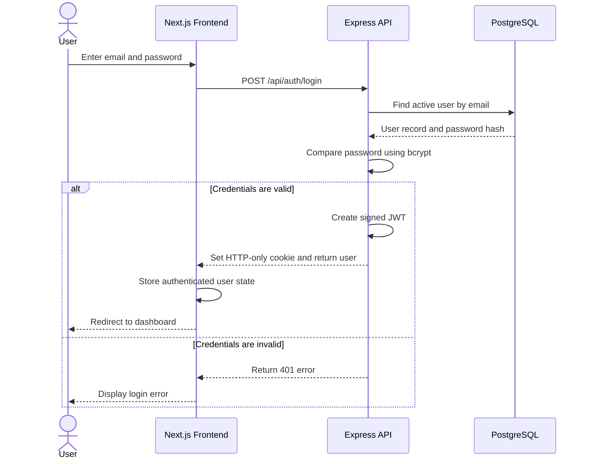
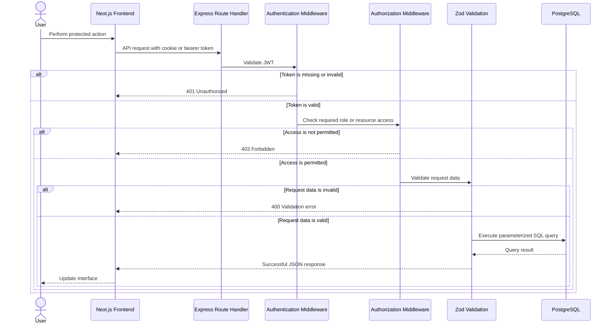
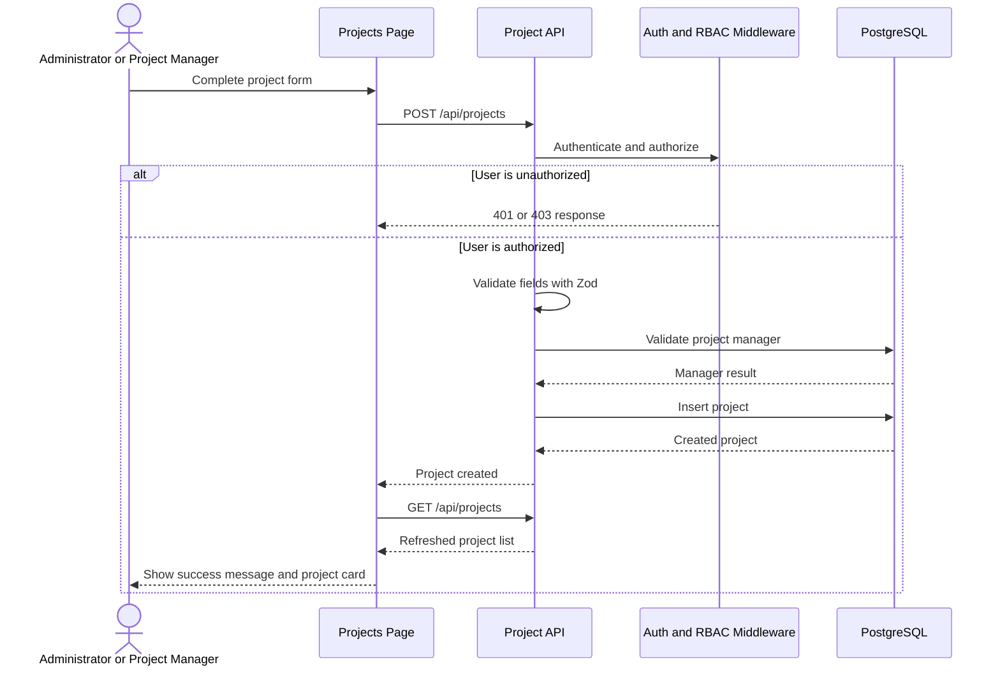
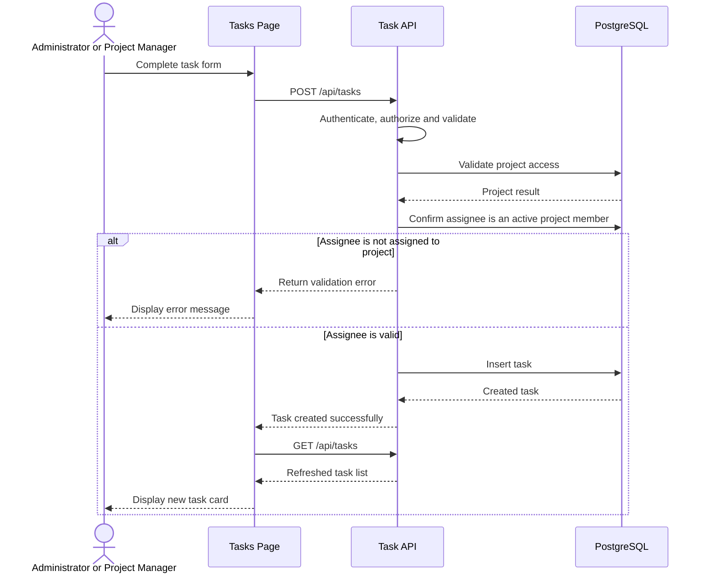
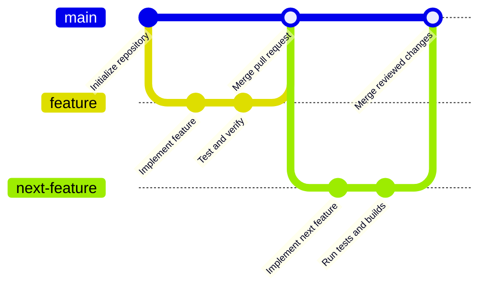
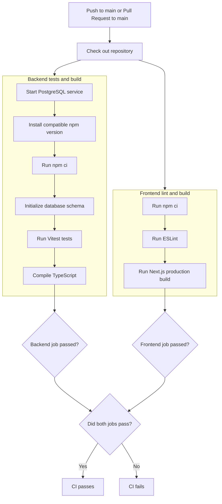

# TaskFlow System Diagrams

This document contains the main architectural, database, use-case, and workflow diagrams for TaskFlow.

GitHub renders these diagrams automatically using Mermaid.

## 1. System architecture

```mermaid
flowchart LR
    Browser[User Web Browser]

    subgraph Frontend
        NextJS[Next.js Frontend]
        AuthProvider[Authentication Provider]
        Pages[Login, Dashboard, Users, Projects and Tasks Pages]
    end

    subgraph Backend
        Express[Express REST API]
        Security[Helmet, CORS and Rate Limiting]
        Routes[Auth, User, Project and Task Routes]
        PublicRoutes[Public Authentication Routes]
        ProtectedRoutes[Protected API Routes]
        Auth[JWT Authentication Middleware]
        RBAC[Role-Based Authorization]
        Validation[Zod Request Validation]
    end

    Database[(PostgreSQL Database)]

    Browser --> NextJS
    NextJS --> AuthProvider
    AuthProvider --> Pages
    Pages -->|HTTP requests with credentials| Express

    Express --> Security
    Security --> Routes
    Routes --> PublicRoutes
    Routes --> ProtectedRoutes
    PublicRoutes --> Validation
    ProtectedRoutes --> Auth
    Auth --> RBAC
    RBAC --> Validation
    Validation -->|Parameterized SQL queries| Database
```

## 2. Development and continuous-integration architecture

## 3. Entity relationship diagram

## 4. Role-based use-case diagram

## 5. Authentication sequence

## 6. Protected API request sequence

## 7. Project creation workflow

## 8. Task creation workflow

## 9. Git and pull-request workflow

## 10. Continuous integration workflow

